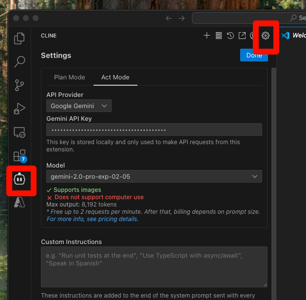
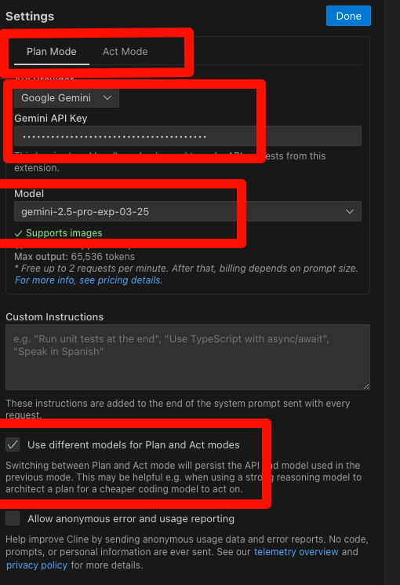
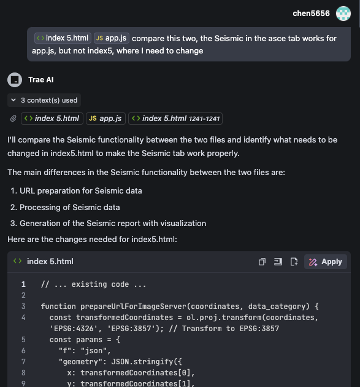

This guide will walk you through setting up CLINE with a Gemini API key from Google, adding CLINE to VS Code, configuring the Gemini key for CLINE, and using chat/plan to help with your coding.

## 1. Applying for a Gemini API Key from Google

To use CLINE with the Gemini API, you'll need an API key from Google. Here's how to get one:

1.  **Go to the Google AI Studio website:** [https://makersuite.google.com/app/apikey](https://makersuite.google.com/app/apikey)
2.  **Sign in with your Google account.**
3.  **Create a new API key.** You may need to agree to the terms of service.
4.  **Copy the API key.** You'll need this in the next steps.

**Important:** Treat your API key like a password. Do not share it publicly or commit it to version control.

## 2. Adding CLINE to VS Code

CLINE is a VS Code extension. Here's how to add it:

1.  **Open VS Code.**
2.  **Go to the Extensions Marketplace:** Click on the Extensions icon in the Activity Bar on the side of the window (or press `Ctrl+Shift+X`).
3.  **Search for "CLINE".**
4.  **Find the CLINE extension** (likely named something like "Cline AI Assistant").
5.  **Click "Install".**
6.  **Reload VS Code** if prompted.

## 3. Setting up the Gemini Key for CLINE

Once CLINE is installed, you need to configure it with your Gemini API key:
1. Open setting
   

2.  Set Gemini API key for Plan Mode and Act Mode separately.
		i. use pro model for plan, and flash model for act. because the requests per minute are different for each model.

   

## 4. Using Chat/Plan to Help Your Coding

CLINE provides two main modes for assisting with your coding: Plan and Act.
*   **Plan:** Use the Plan mode for more complex tasks, such as designing a new feature, refactoring existing code, or understanding a large codebase.  In Plan mode, CLINE will work with you to create a detailed plan, breaking down the task into smaller, manageable steps.  You can then execute the plan step-by-step, using CLINE to assist with each step.
* ** Act:** Use the Act mode for quick questions, code snippets, debugging help, and general coding assistance.  You can ask CLINE to explain code, suggest improvements, fix a bug, or apply code changes.

**Example Usage:**

